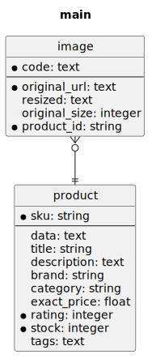

# survos/dummy-bundle

Doctrine-backed demo entities and a loader for DummyJSON data.

Current scope:
- `User`, `Post`, and `Comment` entities with relations
- `Product`, `Image`, and `ProductReview` entities
- repository services
- Doctrine mapping registration by the bundle
- `dummy:load` command

This bundle is currently about loading demo data. It does not provide a UI.

## Quickstart

Copy and paste this into a shell:

```bash
symfony new dummy-demo --webapp
cd dummy-demo
echo 'DATABASE_URL=sqlite:///%kernel.project_dir%/var/data.db' > .env.local
composer req survos/dummy-bundle
bin/console doctrine:database:create --if-not-exists
bin/console doctrine:schema:update --force
bin/console dummy:load --purge
bin/console doctrine:query:sql "select count(*) from product"
```

## Local Path Repository

If you are developing this bundle locally from `~/sites/mono/bu/dummy-bundle`, initialize the app like this instead:

```bash
symfony new dummy-demo --webapp
cd dummy-demo
echo 'DATABASE_URL=sqlite:///%kernel.project_dir%/var/data.db' > .env.local
composer config repositories.survos-dummy path ~/sites/mono/bu/dummy-bundle
composer req survos/dummy-bundle
bin/console doctrine:database:create --if-not-exists
bin/console doctrine:schema:update --force
bin/console dummy:load --purge
bin/console doctrine:query:sql "select count(*) from product"
```

## Entity Diagram

Generate the ER diagram in the demo app root:

```bash
composer req --dev jawira/doctrine-diagram-bundle
mkdir -p docs
bin/console doctrine:diagram:er --filename=docs/er.svg --exclude=doctrine_migration_versions,messenger_messages
```

Then include it in your project README with a few lines of markdown:

```md
## Entity Diagram


```

## Notes

- `dummy:load` loads users, posts, comments, products, product reviews, and images.
- It prints a final summary with how many of each entity were loaded.
- DummyJSON post comments belong to both a post and a user.
- DummyJSON product reviews are embedded on products and include reviewer name/email, not a user id.
- `dummy:load` hard-codes the DummyJSON endpoints for now.
